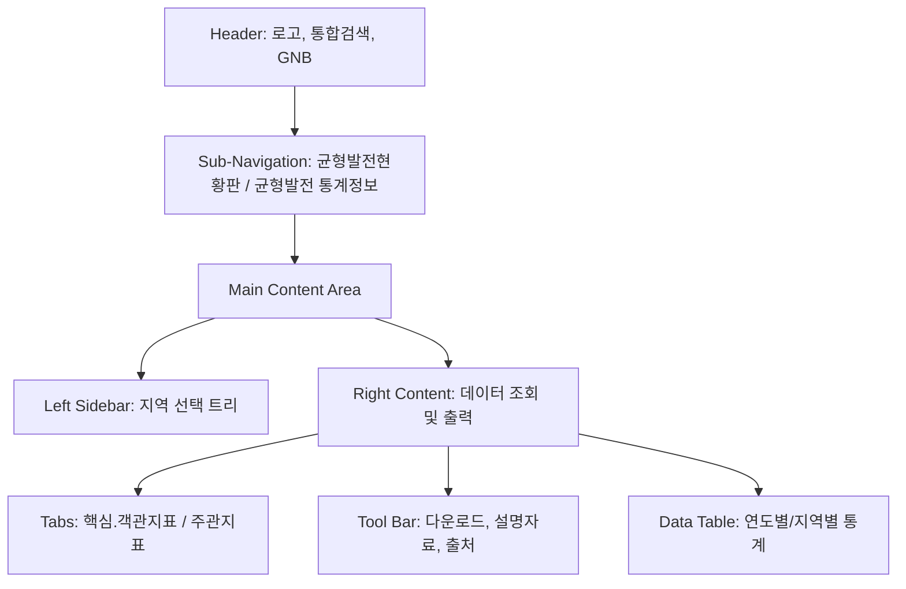

# NABIS 균형발전지표 페이지 구조 및 특징 분석 보고서

- [1. 개요](#1-개요)
- [2. 페이지 레이아웃 구조](#2-페이지-레이아웃-구조)
- [3. 주요 기능 및 특징](#3-주요-기능-및-특징)
- [4. 데이터 테이블 구조](#4-데이터-테이블-구조)
- [5. 사용자 상호작용 흐름](#5-사용자-상호작용-흐름)

## 1. 개요
본 보고서는 [NABIS(균형발전종합정보시스템)](https://www.nabis.go.kr/totalStatisticsDetailView.do?menucd=168&menuFlag=Y)의 '균형발전지표' 상세 페이지를 분석한 결과입니다. 이 페이지는 국가 통계 데이터를 지역별로 비교하고 상세 수치를 제공하는 고밀도 데이터 중심의 인터페이스를 가지고 있습니다.

## 2. 페이지 레이아웃 구조
전체적인 구조는 사용자가 지역 및 지표를 신속하게 필터링하고 결과를 확인할 수 있도록 3단계 레이아웃(GNB, 사이드바, 메인 콘텐츠)으로 구성되어 있습니다.

## 3. 주요 기능 및 특징
해당 페이지의 핵심적인 기술적, 사용자 경험적 특징은 다음과 같습니다.

### 3.1 지능형 필터링 시스템
- **지역별 계층 구조 (jstree)**: 왼쪽 사이드바에 위치한 트리 구조를 통해 전국 단위부터 시/군/구 단위까지 세밀한 지역 선택이 가능합니다. 최상위 '전국' 노드 하위에 **17개 시·도(서울특별시~제주특별자치도)**가 위치하며, 각 시·도의 확장 아이콘(+) 또는 이름을 클릭하면 해당 기초지방자치단체인 **하위 시·군·구 목록**이 동적으로 펼쳐지는 전형적인 드릴다운(Drill-down) 계층 구조를 갖추고 있습니다.
- **지표 유형 전환**: '핵심·객관지표(정량 데이터)'와 '주관지표(정성 설문 데이터)'를 탭 형태로 구분하여 데이터 성격에 따라 최적화된 보기 환경을 제공합니다.
- **동적 로딩 (AJAX)**: 지역이나 지표 탭을 변경할 때 페이지 전체를 새로고침하지 않고, 하단의 데이터 테이블만 즉시 업데이트하여 빠른 응답성을 제공합니다.

### 3.2 데이터 활용성 강화
- **다양한 포맷의 데이터 내려받기**: 엑셀(지자체/전국 단위 별도), PDF(지표 설명자료) 등 분석 목적에 맞는 다양한 다운로드 기능을 제공합니다.
- **과거 데이터 조회**: 현재 표시되는 최신 연도 데이터 외에도 '과거데이터 조회' 버튼을 통해 시계열 분석을 위한 이전 데이터 접근이 용이합니다.

## 4. 데이터 테이블 구조
통계 수치를 명확하게 비교하기 위한 복합 헤더 구조를 사용하고 있습니다.

| Category | Description |
| :--- | :--- |
| **Headers** | Indicator Category, Sector, Name, Unit, and Multi-year comparison columns |
| **Columns** | Each publication year (2023-2025) is split into "National Average" and "Selected Local Value" |
| **Scrolling** | Fixed headers with horizontal and vertical scroll for large datasets |

## 5. 사용자 상호작용 흐름
1. **지표 유형 선택**: 상단 탭에서 핵심/객관 또는 주관 지표를 선택합니다.
2. **지역 필터 적용**: 사이드바 트리에서 분석하고자 하는 특정 시/군/구를 클릭합니다.
3. **데이터 확인 및 비교**: 선택된 지역의 통계값이 전국 평균과 대비되어 테이블에 로드됩니다.
4. **결과 내보내기**: 필요한 경우 엑셀 다운로드 버튼을 눌러 데이터를 오프라인에서 활용합니다.

---
생성일: 2026-02-20
Google Antigravity가 Q의 지침에 따라 생성함
